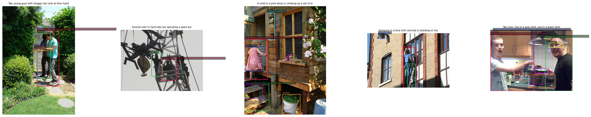

# Region-Grounded Fine-Tuning for Late-Interaction VLMs
## Intermediate Progress Report

**Siddharth Raj and Aniket Agrawal — TTIC 31280, Spring 2026**
**Date: May 14, 2026**

---

## a) Experiment Status: What's Done and What's Delayed

### Completed

**Infrastructure and baselines (Stages 0–1 of the pipeline) are fully operational.**

We have established a clean evaluation harness using MaskCLIP-style last-attention bypass on PASCAL VOC 2012 val (200 images, τ=0.0). This allowed us to benchmark both CLIP and SigLIP backbones before any fine-tuning:

| Model | Method | VOC 2012 val mIoU |
|---|---|---|
| CLIP ViT-B/16 | Standard | 8.46% |
| CLIP ViT-B/16 | MaskCLIP | 19.90% (published: 22.4%) |
| CLIP ViT-B/16 | SCLIP | 14.01% (published: 35.6%) |
| SigLIP-B/16-384 | MaskCLIP (frozen B0) | **1.43%** |

The SigLIP B0 frozen baseline of 1.43% is expectedly low — SigLIP uses a global sigmoid contrastive loss and its patch tokens were never directly aligned to text tokens, so spatial information is latent rather than explicit. The gap from published CLIP numbers is attributable to input resolution (we use the standard processor default rather than 336px), lack of prompt ensembling, and absence of PAMR post-processing.

The full training pipeline (`graft-training.ipynb`) has been implemented end-to-end: SigLIP-B/16-384 with LoRA (rank=4, α=16, targets=`q_proj` and `v_proj`, 0.14% trainable parameters), the Flickr30k Entities dataset loader (29,000 train images, 12 phrase-bbox pairs per image on average), the FILIP-style region loss with vectorized patch-token matching, gradient checkpointing, and W&B logging.

Training experiments (M_human, M_auto) are currently in progress on a Colab L4 GPU. We have run the Flickr30k phrase grounding benchmarks on the frozen B0 model (`06_pointing_game_eval.ipynb`), establishing baselines for our two primary metrics:

| Metric | Frozen B0 |
|---|---|
| Pointing Game Accuracy | 14.74% |
| Recall@1 (IoU ≥ 0.5), top-10 patches | 6.83% |
| Recall@1 (IoU ≥ 0.5), top-25 patches | 7.91% |
| Recall@1 (IoU ≥ 0.5), halfmax threshold | 7.58% |

Following an explicit discussion, we have pivoted the training dataset from CC3M to **Flickr30k**.

As the auto-supervision source on Flickr30k, we identified **Florence-2** (Microsoft, 231M parameters) as a strong candidate for generating (region, caption) pairs without human annotation. Florence-2 supports a `<DENSE_REGION_CAPTION>` task that produces multiple localised bounding boxes with short natural-language labels in a single forward pass — precisely the (bbox, phrase) format our region loss consumes. In `05a_florence2_auto_bbox.ipynb` we ran Florence-2 base on five Flickr30k test images and visualised the results (see Figure 1). The model correctly grounds fine-grained entities such as individual people, objects, and background elements with tight boxes and descriptive labels, and does so at a fraction of the inference cost of Qwen2-VL-2B. We will use Florence-2 to generate M_auto bounding boxes and captions across the full Flickr30k training split.

**Figure 1.** Florence-2 `<DENSE_REGION_CAPTION>` outputs on five Flickr30k test images. Each coloured box is an automatically generated (bbox, label) pair. The model produces 5–10 regions per image covering both foreground entities and salient background elements, with labels that are grammatically compatible with our phrase-encoder.

---

## b) Early Findings

We have completed benchmarking across all three evaluation metrics on baseline models. Results so far are:

**PASCAL VOC 2012 val — zero-shot semantic segmentation mIoU** (`02d_maskclip_eval.ipynb`, `03_siglip_b0_eval.ipynb`)

| Model | Method | mIoU |
|---|---|---|
| CLIP ViT-B/16 | Standard | 8.46% |
| CLIP ViT-B/16 | MaskCLIP | 19.90% |
| CLIP ViT-B/16 | SCLIP | 14.01% |
| SigLIP-B/16-384 | MaskCLIP (frozen B0) | 1.43% |

**Flickr30k Pointing Game Accuracy** (`06_pointing_game_eval.ipynb`, 200 val images, 2,124 phrase-bbox pairs)

| Model | Pointing Game Acc. |
|---|---|
| SigLIP-B/16-384 (frozen B0) | 14.74% |

**Flickr30k Recall@1 at IoU ≥ 0.5** (`06_pointing_game_eval.ipynb`, same 200 val images)

| Model | Patch selection | Hits | Total | Recall@1 |
|---|---|---|---|---|
| SigLIP-B/16-384 (frozen B0) | top-10 | 145 | 2,124 | 6.83% |
| SigLIP-B/16-384 (frozen B0) | top-25 | 168 | 2,124 | 7.91% |
| SigLIP-B/16-384 (frozen B0) | halfmax | 161 | 2,124 | 7.58% |

Worst 5 images by pointing game accuracy: 289625522.jpg (0/5), 481054596.jpg (0/13), 6371136393.jpg (0/19), 2579268572.jpg (0/7), 4407490214.jpg (0/12). Best 5: 1752454466.jpg (4/4, 100%), 3578841731.jpg (3/4, 75%), 1206506157.jpg (3/4, 75%), 210625425.jpg (3/4, 75%), 4678723492.jpg (4/6, 67%).

Training experiments (M_human, M_auto) are currently in progress and results are not yet available. The above frozen B0 numbers serve as the baselines against which trained models will be compared.

The Flickr30k grounding numbers show that the frozen model's patch representations carry almost no explicit phrase-grounding signal — 14.74% pointing game is near chance for typical Flickr30k box sizes, and the further drop to ~7% Recall@1 indicates the top-k patches are scattered rather than forming a coherent spatial cluster. This is the baseline the region loss is expected to improve.

---

## c) Feasibility Assessment, Revised Evaluation Design, and Scope Revision

### Revised Evaluation Design

After running baselines and reflecting on the experimental design, we have revised our evaluation metrics. The original proposal used PASCAL VOC 2012 mIoU as the primary metric, along with ImageNet-1K and compositionality benchmarks. We now use the following three metrics:

**1. Flickr30k Pointing Game Accuracy (Primary)**

For each (phrase, bbox) pair in the Flickr30k Entities val split, we encode the phrase, extract per-patch similarity scores via MaskCLIP-style last-attention bypass, find the single highest-scoring patch, and check whether its centre falls inside the human-annotated GT bounding box. Accuracy = fraction of hits over all phrase-bbox pairs.

This is a direct measure of whether fine-tuning with the region loss teaches the model to spatially localize the referent of a noun phrase — exactly what we train for. The frozen B0 baseline of 14.74% is near chance, leaving substantial headroom.

**2. Flickr30k Recall@1 at IoU ≥ 0.5 (Primary)**

This is the standard phrase grounding metric introduced in the Flickr30k Entities paper (Plummer et al., ICCV 2015) and used across the phrase grounding literature. For each (phrase, bbox) pair, we select the top-k highest-scoring patches, form their tight bounding box in original image coordinates, and check whether its IoU with the GT box exceeds 0.5. A hit requires the predicted region to substantially overlap the right area — not just a single point landing inside it. The frozen B0 baseline is 6.83–7.91% depending on the patch selection strategy, far below published CLIP-based zero-shot grounding numbers of 40–65%, confirming that SigLIP's patch tokens carry almost no explicit phrase-grounding signal.

Both Flickr30k metrics are well-suited for this project because the training task and evaluation task are identical — phrase-to-region alignment — just on held-out images. Any improvement from the region loss will show up directly and unambiguously.

**3. PASCAL VOC 2012 mIoU (Guardrail only)**

We retain VOC mIoU but demote it from a primary metric to a sanity check. There are two reasons it is not a good primary metric for this project. First, SigLIP is pre-trained on billions of image-text pairs; fine-tuning on 29k additional Flickr30k images will not move a class-level segmentation needle meaningfully, and any change in mIoU is as likely to be noise as signal. Second, the training task and eval task are genuinely different: we train on noun phrase grounding ("two young guys", "a red jacket") and VOC tests semantic class labeling ("aeroplane", "cat") — there is no direct supervision bridge between them. VOC mIoU therefore serves only as a check that fine-tuning does not catastrophically destroy the frozen model's existing spatial structure. We do not expect or claim improvement on this metric.

### Proposed Revised Scope

**Drop CC3M + Qwen2-VL; use Flickr30k Entities as the human-supervision tier and Florence-2 as the auto-supervision tier.**

The original proposal's true scientific question is: *does explicit region-level supervision improve patch-token spatial grounding in a VLM, and can this supervision be generated automatically rather than hand-labeled?* We can answer this with Flickr30k, which provides both:

- **M_human**: human-annotated phrase-bbox pairs from Flickr30k Entities (already implemented) — the clean upper-bound condition
- **M_auto**: Florence-2 `<DENSE_REGION_CAPTION>` auto-bboxes and captions on the same Flickr30k images — the self-supervised condition, with Florence-2 as a frozen annotator replacing the originally proposed Qwen2-VL-2B

This two-condition comparison still tests the central hypothesis, avoids the CC3M download and 30-hour Qwen2-VL inference cost, and reuses all training and evaluation infrastructure already built.

**Minimal deliverable:** A three-way comparison table — frozen B0, M_human, M_auto — on Pointing Game Accuracy and Recall@1 (IoU ≥ 0.5), with VOC mIoU reported as a guardrail, demonstrating whether region supervision improves phrase grounding and whether auto-generated supervision approaches human-labeled quality.

This revised scope is achievable within the remaining compute budget and produces a complete, interpretable comparison rather than an incomplete pipeline with untested components.
